# Authentication Overview

This document outlines the authentication mechanisms used in the MyHives application.

## Authentication Type

The project uses **JWT (JSON Web Token)** authentication.

- **Mechanism:** Tokens are generated upon login and stored in an **HTTP-only cookie** named `jwtcookie`.
- **Strategies:**
  1.  **Local Strategy:** Email and Password login using `bcryptjs` for password hashing.
  2.  **OAuth2:** Google Login integration.
- **Session Management:** Stateless (JWT) with a `refreshToken` mechanism for token rotation.

## Architecture Components

- **Controller (`AuthController`)**: Handles HTTP requests (`login`, `register`, `logout`, `getMe`), manages cookies, and calls the service layer.
- **Service (`UserService`)**: Contains business logic for user verification and Google user handling.
- **Repository (`UserRepository`)**: Performs database operations via Sequelize.
- **Middleware**: Verifies JWTs from cookies/headers and populates `req.currentUser`.
- **Redis**: Used for token blacklisting during logout.

## Authentication Flow Diagram

```mermaid
sequenceDiagram
    autonumber
    participant Client as Frontend / Client
    participant Middleware as Auth Middleware
    participant Controller as AuthController
    participant Service as UserService
    participant Repo as UserRepository
    participant DB as Database (Sequelize)
    participant Redis as Redis Cache

    %% LOGIN FLOW
    rect rgb(240, 248, 255)
        note over Client, Redis: 🔐 Login Flow (Local Strategy)
        Client->>Controller: POST /login {email, password}
        Controller->>Service: findUserByEmailWithRoles(email)
        Service->>Repo: findUserWithRoles(email)
        Repo->>DB: SELECT ... JOIN Roles
        DB-->>Repo: User Record
        Repo-->>Service: UserDTO
        Service-->>Controller: UserDTO

        alt Invalid Credentials
            Controller-->>Client: 401 Unauthorized
        else Valid Credentials
            Controller->>Controller: bcrypt.compare(password)
            Controller->>Controller: generateToken(JWT)
            Controller-->>Client: 200 OK (Set-Cookie: jwtcookie, Body: token)
        end
    end

    %% PROTECTED ROUTE FLOW
    rect rgb(255, 250, 240)
        note over Client, Redis: 🛡️ Protected Route Flow (e.g., Get Me)
        Client->>Middleware: GET /me (Cookie: jwtcookie)
        Middleware->>Middleware: Verify JWT Signature

        alt Invalid Token
            Middleware-->>Client: 401 Unauthorized
        else Valid Token
            Middleware->>Controller: next() [req.currentUser set]
            Controller->>Service: findUserById(userId)
            Service->>Repo: readById(userId)
            Repo->>DB: SELECT ...
            DB-->>Repo: User Record
            Repo-->>Service: UserDTO
            Service-->>Controller: UserDTO
            Controller-->>Client: 200 OK { user profile }
        end
    end

    %% LOGOUT FLOW
    rect rgb(255, 240, 245)
        note over Client, Redis: 🚪 Logout Flow
        Client->>Controller: POST /logout (Header: Bearer token)
        Controller->>Redis: SET blacklist_{token} (TTL=expiry)
        Controller-->>Client: 200 OK (Clear-Cookie: jwtcookie)
    end
```

## Key Concepts for Onboarding

1.  **JWT & Cookies**: The system uses **JSON Web Tokens (JWT)** for stateless authentication. Upon login, the token is sent back in two ways: inside the JSON body and as an **HTTP-only cookie** (`jwtcookie`). This cookie is the primary method for persisting the session in the browser.
2.  **Middleware**: An `authenticate` middleware sits before protected routes (like `getMe`), verifies the JWT signature, and populates `req.currentUser`.
3.  **Token Blacklisting**: The `logout` function uses **Redis** to "blacklist" tokens until they naturally expire. This prevents a stolen token from being used after a user has explicitly logged out.
4.  **Layered Architecture**: Separation of concerns:
    - **Controller**: Handles HTTP requests/responses and cookies.
    - **Service**: Handles business logic (e.g., password hashing comparison).
    - **Repository**: Handles direct database queries via Sequelize.
