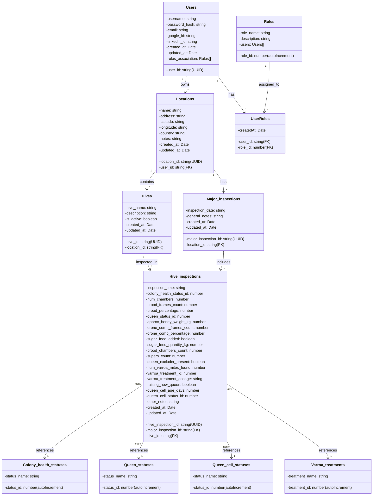

# MyHives Database Models - Class Diagram

## Mermaid Class Diagram

## Entity Relationship Summary

### Core Entities
1. **Users** - Beekeepers/system users with authentication
2. **Locations** - Apiaries or locations owned by users
3. **Hives** - Individual hives within locations
4. **Major_inspections** - Scheduled inspections at a location
5. **Hive_inspections** - Detailed inspection records for individual hives

### Lookup/Reference Tables
- **Roles** - User roles (admin, beekeeper, etc.)
- **UserRoles** - Junction table for many-to-many user-to-role relationship
- **Colony_health_statuses** - Status values for colony health
- **Queen_statuses** - Status values for queen condition
- **Queen_cell_statuses** - Status values for queen cells
- **Varroa_treatments** - Types of varroa mite treatments

### Key Relationships
- **Users 1:N Locations** - One user owns multiple locations
- **Users M:N Roles** - Multiple users can have multiple roles (via UserRoles)
- **Locations 1:N Hives** - One location contains multiple hives
- **Locations 1:N Major_inspections** - One location has multiple inspections
- **Major_inspections 1:N Hive_inspections** - One major inspection includes multiple hive inspections
- **Hives 1:N Hive_inspections** - One hive has multiple inspection records
- **Hive_inspections M:1 Reference Tables** - Each hive inspection references status/treatment types
