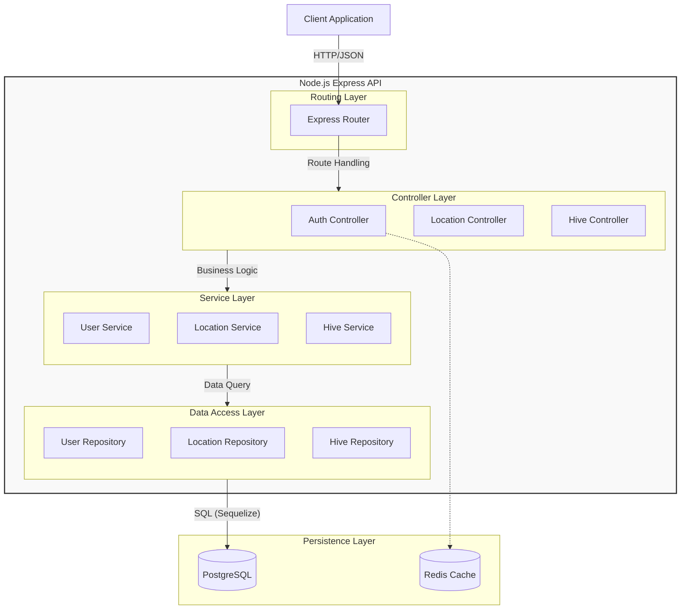

# Software Architecture

This document outlines the logical structure and modular design of the MyHives application.

## Logical Layered Architecture

The application follows a strict **Layered Architecture** to ensure separation of concerns and maintainability.

## Layer Responsibilities

1.  **Routing Layer**: Defines the API endpoints (e.g., `/api/v1/locations`) and directs requests to the appropriate controllers.
2.  **Controller Layer**: Handles the HTTP request lifecycle. It parses the request body, validates basic input, calls the service layer, and formats the HTTP response. **No business logic resides here.**
3.  **Service Layer**: The heart of the application. It contains all business rules, complex validations (e.g., "User must own the location to add a hive"), and calculations. It is agnostic of the HTTP layer.
4.  **Data Access Layer (Repositories)**: Abstracts the database implementation. It uses Sequelize models to perform CRUD operations. This allows the service layer to remain focused on logic rather than SQL queries.
5.  **Persistence Layer**: The physical storage systems (PostgreSQL for relational data, Redis for temporary session/token data).

## Cross-Cutting Concerns

- **Middleware**: Handles authentication (`authenticate`), error handling, and logging globally before requests reach the controllers.
- **DTOs (Data Transfer Objects)**: Define the shape of data passed between layers (e.g., `UserCreationDTO`), ensuring type safety and decoupling the internal database schema from the external API contract.
