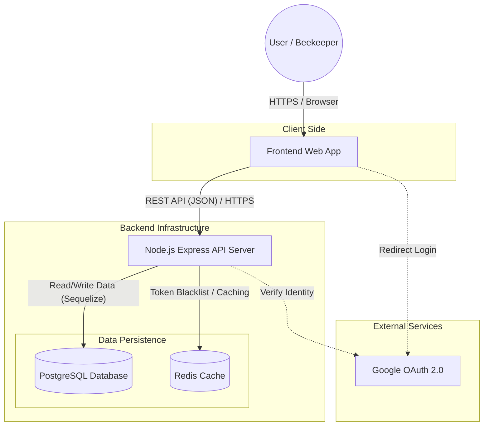

# Deployment & Architecture

This document illustrates the high-level deployment architecture and component interactions for the MyHives application.

## System Architecture Diagram

The following diagram visualizes how the Client, Server, Database, and External Services interact.

## Component Details

1.  **Frontend Web App**: The client-side interface (SPA) used by beekeepers to manage their data.
2.  **Node.js Express API**: The core application server. It handles:
    - **Authentication**: JWT generation, validation, and Google OAuth callbacks.
    - **Business Logic**: Managing Hives, Locations, and Inspections.
3.  **PostgreSQL**: The primary relational database storing persistent data (Users, Roles, Locations, Hives, Inspections).
4.  **Redis**: An in-memory key-value store used primarily for **Token Blacklisting** (logout functionality) and potentially for caching frequently accessed data.
5.  **Google OAuth**: An external identity provider allowing users to sign in using their Google accounts.
