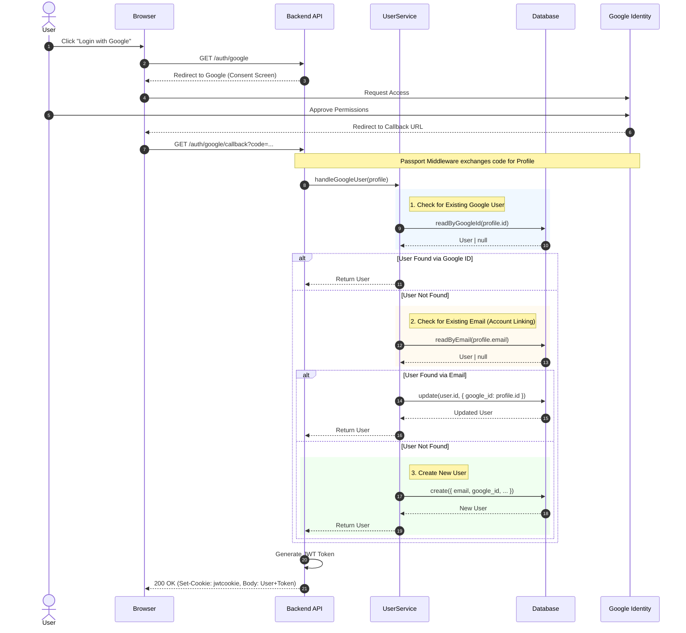

# Google OAuth2 Authentication Flow

This document details the sequence of events for a user logging in via Google OAuth2.

## Sequence Diagram

## Logic Breakdown

The `UserService.handleGoogleUser` method implements a smart account linking strategy:

1.  **Direct Match**: First, it checks if a user already exists with the incoming `google_id`.
2.  **Account Linking**: If no Google match is found, it checks if a user exists with the same **email address**. If found, it updates that user record to include the `google_id`, effectively linking the local account with the Google account.
3.  **Registration**: If neither exists, it creates a completely new user record.
