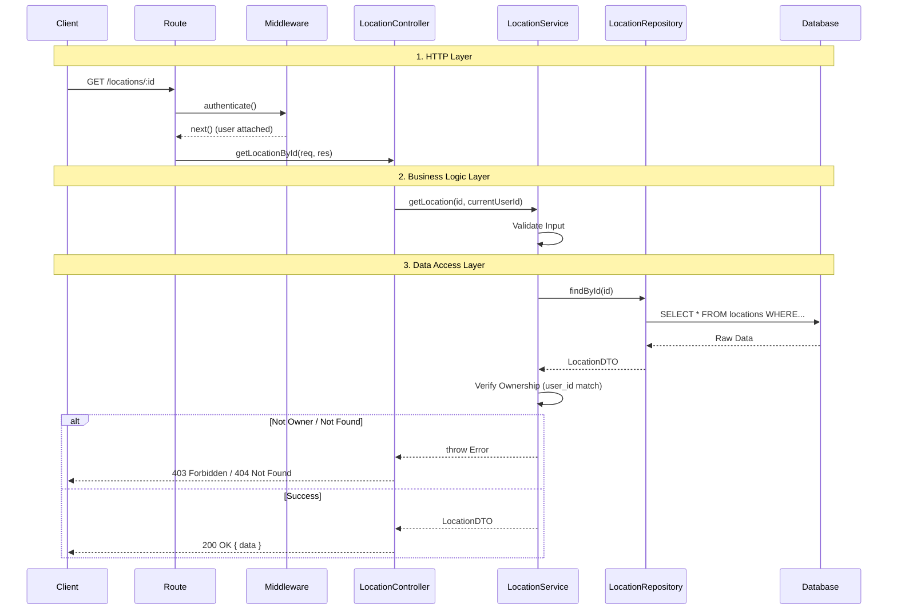

# Request Lifecycle & Layered Architecture

This document explains the standard flow of data through the application layers. Understanding this pattern is crucial for adding new features and maintaining separation of concerns.

## Architectural Layers

The application follows a strict **Separation of Concerns**:

1.  **Routes**: Define endpoints and map them to controller methods.
2.  **Middleware**: Handles cross-cutting concerns (Auth, Validation, Error Handling).
3.  **Controllers**: Handle HTTP concerns (Request parsing, Response formatting, Status codes). **No business logic here.**
4.  **Services**: Contain **Business Logic** (Validations, Calculations, Ownership Checks). **No SQL queries here.**
5.  **Repositories**: Handle **Data Access** (Sequelize queries, Database interactions). **No business logic here.**

## Sequence Diagram: Standard Data Fetch

The following diagram illustrates the flow for a typical request, such as "Get Location by ID".

