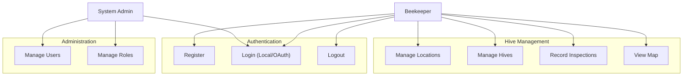

# System Use Cases

This diagram provides a high-level overview of the functional requirements and actor interactions within the MyHives application.

```mermaid
flowchart TD
    subgraph Authentication["Authentication"]
        UC1["Register"]
        UC2["Login (Local/OAuth)"]
        UC3["Logout"]
    end

    subgraph HiveManagement["Hive Management"]
        UC4["Manage Locations"]
        UC5["Manage Hives"]
        UC6["Record Inspections"]
        UC7["View Map"]
    end

    subgraph Administration["Administration"]
        UC8["Manage Users"]
        UC9["Manage Roles"]
    end

    User["Beekeeper"]
    Admin["System Admin"]

    User --> UC1
    User --> UC2
    User --> UC3
    User --> UC4
    User --> UC5
    User --> UC6
    User --> UC7

    Admin --> UC2
    Admin --> UC8
    Admin --> UC9
```
